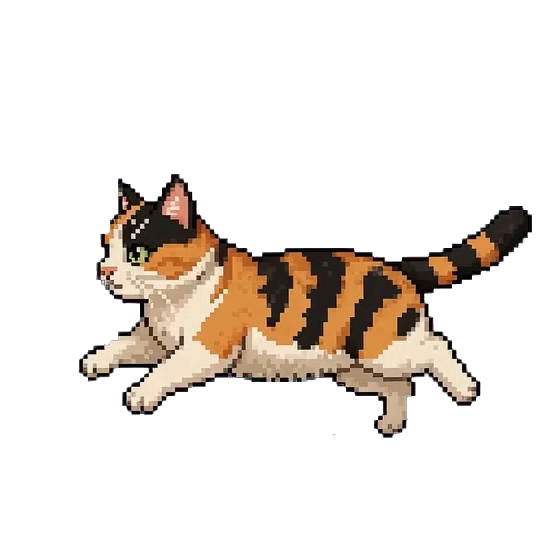

<div align="center">
  
  
  <h1>デスクトップマスコット みたらし</h1>
  <p>画面下を走るかわいい猫のデスクトップマスコット</p>
  <p>
    
    
  </p>
</div>

---

画面下を自動で走るかわいい猫のデスクトップマスコットアプリケーションです。

## 特徴

- **自動走行モード**: 猫が画面下を自動で歩き回ります
- **待機モード**: クリックで待機モード（静止画）に切り替え
- **ドラッグ移動**: クリックしてドラッグすると、画面上の好きな場所に移動できます
- **常に最前面**: 他のウィンドウの上に表示され続けます
- **透過ウィンドウ**: 背景なしでキャラクターが表示されます
- **速度変更**: 右クリックで歩く速度を変更できます

## 操作方法

| 操作 | 結果 |
|------|------|
| **クリック** | 待機/走行モード切り替え |
| **ドラッグ** | 猫を移動 |
| **右クリック** | 歩行速度の変更 (2 → 4 → 6 → 8 → 2...) |

## 技術スタック

- **Electron**: デスクトップアプリケーションフレームワーク
- **Vanilla JS**: 軽量で高速

## インストール

```bash
git clone https://github.com/Sunwood-ai-labs/desktop-pet-mitarashi.git
cd desktop-pet-mitarashi
npm install
```

## 開発

```bash
npm start
```

## ビルド

```bash
# Windows用
npm run build:win

# macOS用
npm run build:mac

# Linux用
npm run build:linux
```

## CI/CD

GitHub Actionsによる自動ビルドとリリース

- **タグプッシュ時 (v*)**: 全プラットフォーム用にビルドし、GitHub Releaseを作成
- **手動実行**: リリースを作成せずにビルドのみ実行

## 開発用スクリプト

### リリースヘッダー生成

GitHubリリース用のヘッダー画像を生成します：

```bash
uv run python scripts/generate_release_header.py --version 0.1.0 --output assets/release-header-v0.1.0.svg
```

**オプション:**
- `--version`: バージョン文字列（例: `0.1.0`）
- `--output`: 出力ファイルパス
- `--source`: 元SVGファイル（デフォルト: `assets/mitarashi_minimal.svg`）

このスクリプトは`mitarashi_minimal.svg`から猫キャラクターを抽出し、Inkscapeメタデータを削除して、プロジェクトのブランドカラーでスタイリングしたヘッダー画像を生成します。

## ライセンス

MIT License - [LICENSE](LICENSE) をご覧ください。

## クレジット

- キャラクターデザイン: オリジナルアーティスト
- Electron で構築
