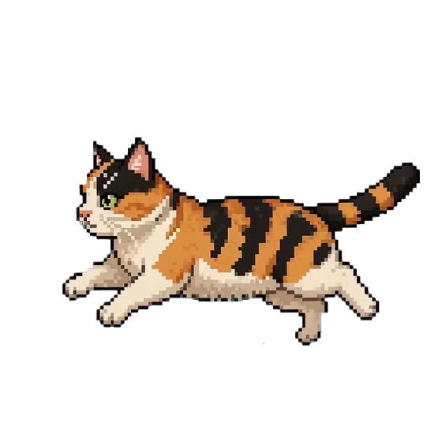

<div align="center">
  
  
  <h1>Desktop Pet Mitarashi</h1>
  <p>Windows / macOS / Linux 向けの、トレイ常駐型 Electron デスクトップペットです。</p>
  <p>
    
    
    
    
  </p>
  <p>
    <a href="./README.md"><strong>English</strong></a>
    |
    <a href="./README.ja.md"><strong>日本語</strong></a>
    |
    <a href="https://sunwood-ai-labs.github.io/desktop-pet-mitarashi/"><strong>Docs</strong></a>
  </p>
</div>

Desktop Pet Mitarashi は、デスクトップ外周を歩くマスコットを表示するアプリです。現在の実装では、猫とペンギンをそれぞれ別の透明ウィンドウとして起動し、クリックを邪魔せず、角も別々に曲がるようになっています。

## 特徴

- 猫とペンギンの 2 体を、独立したウィンドウとして同時に表示できます。
- `Running` / `Idle` / `Random` / `Codex` の各モードをトレイから切り替えられます。
- `Codex Mode` では `.codex/state_5.sqlite` を参照し、Codex の稼働量に応じて移動速度が変化します。
- 猫とペンギンには別々の速度係数があり、完全に同じテンポでは動きません。
- マスコットは常に最前面に表示されつつ、クリックは背後のアプリへ透過します。
- 背景イラストの表示切り替えに対応しています。
- Windows / macOS ではログイン時起動をトレイから設定できます。

## クイックスタート

```bash
git clone https://github.com/Sunwood-ai-labs/desktop-pet-mitarashi.git
cd desktop-pet-mitarashi
npm ci
npm start
```

`npm start` を実行すると、猫とペンギンの両方が起動し、トレイアイコンも表示されます。

## 操作

| 操作 | 内容 |
| --- | --- |
| トレイアイコンをダブルクリック | すべてのマスコットウィンドウをフォーカスを奪わずに再表示 |

## トレイメニュー

| メニュー | 内容 |
| --- | --- |
| `Show` | トレイに隠れているマスコットを再表示 |
| `Start with Windows` / `Start at Login` | 対応 OS でログイン時起動を設定 |
| `Running Mode` / `Idle Mode` / `Random Mode` / `Codex Mode` | マスコットの挙動を即時切り替え。`Codex Mode` は `.codex/state_5.sqlite` をポーリングして速度を調整 |
| `Speed: Fast` / `Medium` / `Slow` | 共通の基準速度を `8` / `5` / `2` に設定し、その上で各マスコットの速度係数を適用 |
| `Show Background` | 背景イラストの表示切り替え |
| `Quit` | アプリを完全終了 |

## Windows 実行ファイル

`npm run build:win` の後は、主に次の 2 つを使います。

- ポータブル実行ファイル: `dist/Mitarashi Desktop Pet <version>.exe`
- 展開済みアプリ: `dist/win-unpacked/Mitarashi Desktop Pet.exe`

展開済み版はパッケージ後の挙動確認に便利で、ポータブル版はそのまま配布したり実行したりしやすい形式です。

## ドキュメント

- 公開ドキュメント: [sunwood-ai-labs.github.io/desktop-pet-mitarashi](https://sunwood-ai-labs.github.io/desktop-pet-mitarashi/)
- ローカルプレビュー:

```bash
npm run docs:install
npm run docs:dev
```

## 開発

```bash
# デスクトップアプリをビルド
npm run build:win
npm run build:mac
npm run build:linux

# ドキュメントサイトをビルド
npm run docs:build
```

ローカル開発では、Windows 向け成果物は Windows 上、macOS 向け成果物は macOS 上でビルドするのが最も安定します。

リリース用ヘッダー画像は、付属の Python スクリプトで再生成できます。

```bash
uv run python scripts/generate_release_header.py --version 0.3.0 --output assets/release-header.svg
```

## 開発者メモ

- `main.js` では `MASCOT_WINDOW_CONFIGS` を使って、マスコットごとに `BrowserWindow` を 1 つずつ生成しています。
- 各ウィンドウは `index.html` を `?mascot=cat` や `?mascot=penguin` のようなクエリ付きで読み込みます。
- レンダラーはそれぞれ独自の外周パス、現在位置、曲がり角、速度係数を持つため、2 体が別々に曲がります。
- トレイからのモード変更や速度変更は、両方のマスコットへまとめて配信されます。

## リリースフロー

- `v*` 形式のタグ push で GitHub Actions がマルチプラットフォームビルドを実行します。
- CI 中にタグのバージョンを `package.json` へ反映し、成果物のバージョンを揃えます。
- ビルド完了後、成果物は GitHub Release へ自動添付されます。
- VitePress ドキュメントは `main` ブランチから GitHub Pages へ公開されます。

## コントリビュート

詳細は [CONTRIBUTING.md](./CONTRIBUTING.md) を参照してください。Issue や Pull Request を歓迎します。

## ライセンス

このプロジェクトは [MIT License](./LICENSE) のもとで公開されています。
